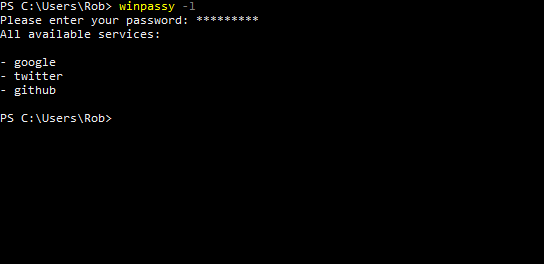

<h1 align="center">WinPass</h1>
<h3 align="center">A password manager that you can manage from the Windows command line.</h3> 

## Features
- Have one master password to manage all of your other passwords
- The master password must be entered in before doing anything with the program
- Store virtually as many services with account names and passwords as you'd like
- Your master password is hashed using SHA512
- Your individual service passwords are encrypted with your master password using SHA256
- Each user can manage their own set of passwords
- Your encrypted services are stored in your user folder (e.g. "C:\Users\\\<UserName>") for ease of access and backup

<h3 align="center">Adding a new service</h3>
<p align="center"></p>

<h3 align="center">List all services</h3>
<p align="center"></p>

<h3 align="center">Get information for a service</h3>
<p align="center"></p>


## Usage

```shell
usage: winpassy [ -a | -l ] [ -c ] [ -d ] <service name>
         -h : Print this usage message
         -a : Add - adds a service to your wpassy file
         -l : list - lists all the services in your wpassy file
         -d : delete - deletes a service in your wpassy file
         -c : copy - copies a service's decrypted password to your clipboard
         -d : delete - deletes a service in your wpassy file
                 a <service name> must be specified
```

## Getting started
Once you've cloned the repo, you can use `build.bat` to build the project if you have clang installed. This will output a file in a local `./bin` directory with an exe that you can run (or move it someone more convenient such as a folder in your $PATH).

If you plan on adding anything or modifying the source code, there is a `DEBUG` flag in `inc/winpassy.h` that can set to `1` for debugging.

## Contributing
Feel free to make a contribution to the project and submit a pull request.
